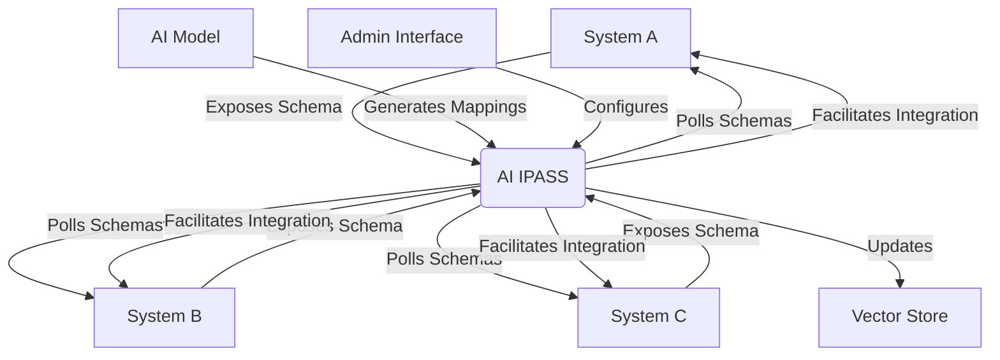

# AI Integration Protocol Architecture

## This diagram illustrates the high-level architecture of the AI Integration Protocol:

- Multiple systems (A, B, C) expose their schemas to the AI IPASS.
- AI IPASS polls these systems regularly for schema updates.
- The AI Model generates integration mappings based on the schemas.
- The Vector Store is updated with new schema information.
- AI IPASS facilitates integration between the connected systems.
- An Admin Interface allows for configuration and management of the AI IPASS.